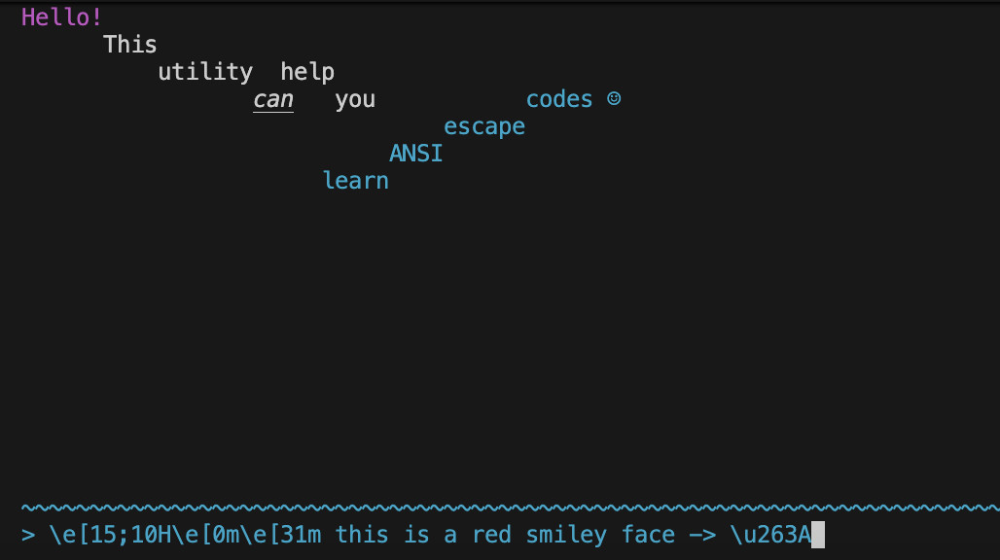
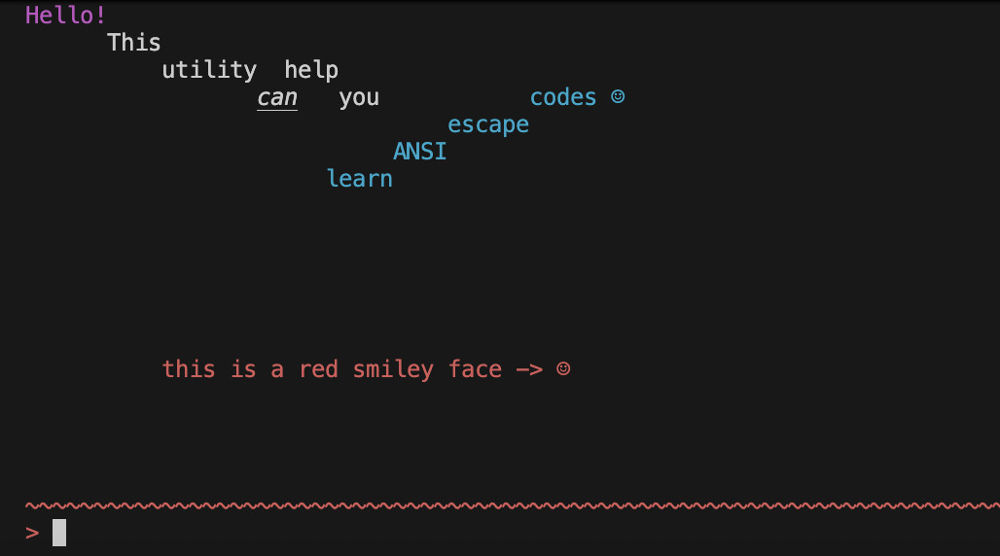

# ANSI Escape

[ANSI escape codes](https://en.wikipedia.org/wiki/ANSI_escape_code) are
supported by most terminals and allow for the creation of Terminal User
Interfaces (TUIs). Escape codes look like `\x1b[1;31m`, `\n`, or `\e[H`, for
example, and specify visual actions in the terminal.

To learn more about these escape codes, I created this interactive TUI for
typing in escape codes and seeing the immediate visual feedback.

## Compilation

The compilation process may itself be compiled by CMake. So to compile the code,
in the root of this repository, do

```bash
cmake . && cmake --build .
```

## Interactive Usage

After compiling the binary, you may run it with

```bash
./ansi-escape
```

In the bottom, you may type in an arbitrary sequence of characters, including
ANSI escapes. After pressing ENTER, the sequence (with the newline you entered
with ENTER being removed), is drawn to the canvas above. The session will stay
open until you type CTRL+C.

## Pipe Usage

You can also use `ansi-escape` in a pipeline by passing "-" as an argument.

```bash
echo "hey\u263A" | ./ansi-escape -
hey☺
```

## Images



